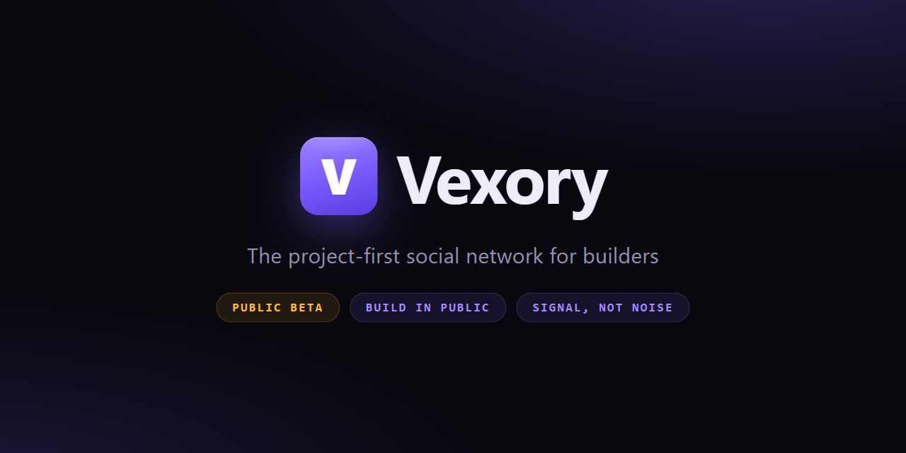
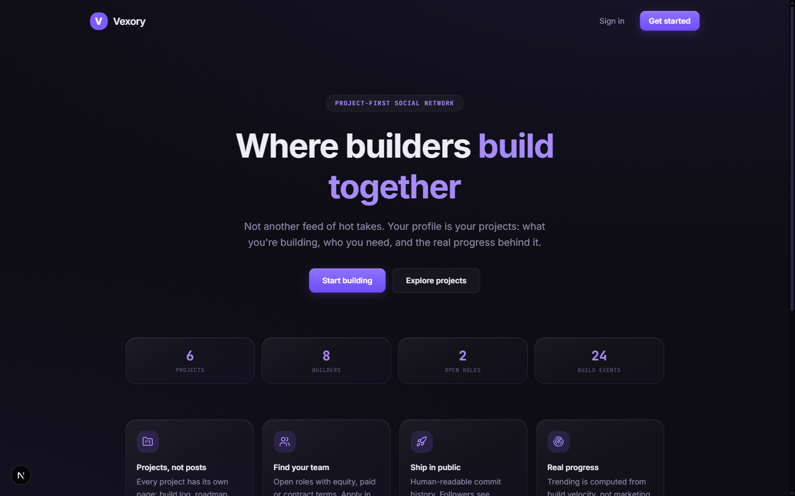
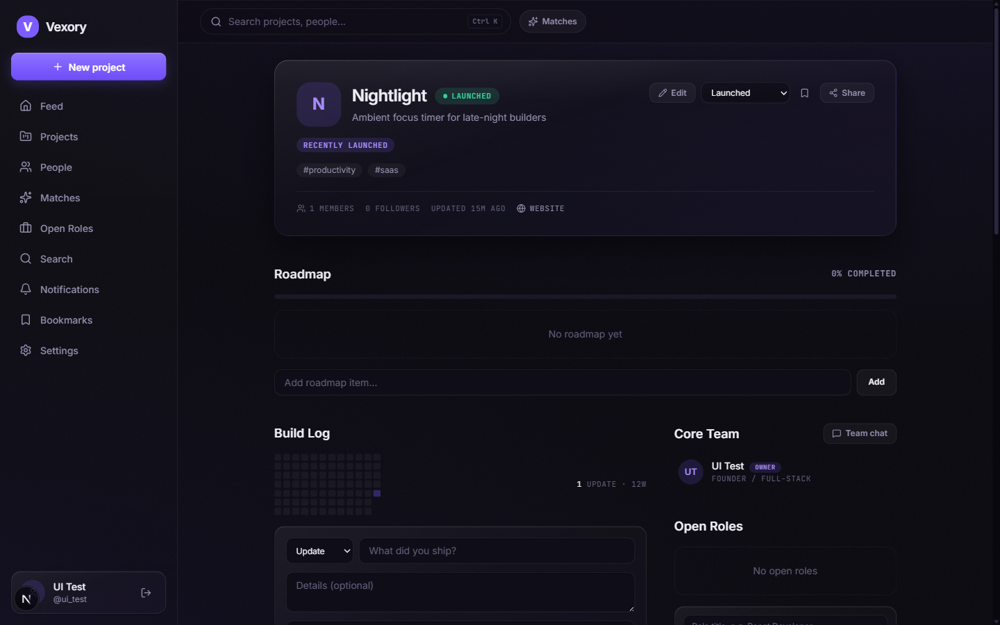

<div align="center">



# Vexory

**The project-first social network for builders.**

Not another feed of hot takes — your profile is your projects: what you're building,
who you need, and the real progress behind it.

[](https://network.vexory.xyz/)
[](#-beta-notice)
[](https://nextjs.org/)
[](#-license)

[**Try the beta →**](https://network.vexory.xyz/)

</div>

---

## ⚠️ Beta notice

> **Vexory is in active development.** This is an early public beta: features change
> quickly, edge cases exist, and **you may run into bugs**. If something breaks,
> that's expected at this stage — feedback and bug reports are very welcome in
> [Issues](../../issues).

---

## ✨ What is Vexory?

Most social networks put the person first and the noise follows. Vexory flips it:
**the Project is the core entity.** Every project gets its own page with a build log,
roadmap, team and open roles — and everything in the feed derives from real product
work, not engagement bait.

**Signal, not noise.**

<div align="center">

</div>

## 🚀 Features

### Projects
- 📦 **Project pages** — build log, roadmap, team, open roles, posts, all in one place
- 📈 **Activity heatmap** — GitHub-style 12-week graph of shipping cadence with streaks
- 🧭 **Journey timeline** — IDEA → BUILDING → MVP → LAUNCHED track plus a dated history of every milestone
- 🔗 **Build proof** — attach commits, demos and deploy links to every update
- 🏷️ **Momentum badges** — earned by real activity: *Shipping weekly*, *Recently launched*, *Hiring now*, *Team forming*
- ✅ **Trust signals** — website / GitHub / demo connected, computed from facts
- 📝 **Founder notes** — why we build this, what problem we solve, what we learned this week
- 🚀 **Launch pages** — a public, shareable page when a project ships (Telegram / X / LinkedIn ready)

### People & teams
- 👥 **Auto-portfolio profiles** — "Currently building" and "Launched" assemble themselves from your projects
- 💼 **Open roles & applications** — equity, paid, contract or volunteer; apply in two clicks
- ✉️ **Team invites** — invite by email or username, with role titles and permissions
- 💬 **Team chat** — a private room per project
- ✨ **Matches** — teammate recommendations based on skills and interests

### Social
- 📰 **Smart feed** — Global, Following, Posts, Launches, Hiring, Milestones and Trending tabs
- ⌨️ **Command palette** — `Ctrl K` from anywhere: search projects, people and roles, or jump to any page
- 🔍 **Universal search** — projects, builders, open roles and posts with type filters
- ❤️ **Likes, comments, bookmarks, follows** — for both people and projects
- 🔔 **Notifications** — follows, applications, comments, invites

<div align="center">

</div>

## 🎨 Design

A custom **"Purple Liquid Glass"** dark UI system: deep navy-black canvas, violet
primary, glass as a material for elevated layers — refractive gradient edges,
cursor-tracked sheen, ambient light fields with film-grain dithering. Fully
responsive down to mobile, with skeleton loading states and reduced-motion support.

## 🛠️ Tech stack

| Layer      | Tech                                              |
| ---------- | ------------------------------------------------- |
| Framework  | [Next.js 16](https://nextjs.org/) (App Router, Server Components, Server Actions) |
| Language   | TypeScript                                        |
| Database   | PostgreSQL + [Prisma 7](https://www.prisma.io/)   |
| Auth       | [Auth.js v5](https://authjs.dev/) (credentials + OAuth-ready) |
| Styling    | [Tailwind CSS 4](https://tailwindcss.com/) + custom design tokens |
| Validation | [Zod 4](https://zod.dev/)                         |
| Icons      | [Lucide](https://lucide.dev/)                     |
| Deploy     | Docker + docker-compose                           |

## 🏁 Getting started

### Prerequisites

- Node.js 20+
- Docker (for PostgreSQL) — or any PostgreSQL 16 instance

### Setup

```bash
# 1. Clone
git clone https://github.com/rasvetovvv/vexory.git
cd vexory

# 2. Install dependencies (also generates the Prisma client)
npm install

# 3. Environment
cp .env.example .env
# fill in DATABASE_URL and AUTH_SECRET

# 4. Start PostgreSQL
docker compose up -d postgres

# 5. Sync the database schema
npx prisma db push

# 6. Run
npm run dev
```

Open [http://localhost:3000](http://localhost:3000) and start building.

### Production (Docker)

```bash
docker compose up -d --build
```

## 🗺️ Roadmap

- [ ] Email notifications & invite delivery
- [ ] Image uploads (avatars, project logos, covers)
- [ ] Real-time chat & notifications
- [ ] Project analytics for owners
- [ ] Investor discovery tools
- [ ] Public API

## 👤 Author

**Vadim** — [@rasvetovvv](https://github.com/rasvetovvv) · vadim.mos.dev@gmail.com

Building Vexory in public. Follow the progress at
[network.vexory.xyz](https://network.vexory.xyz/).

## 📄 License

Proprietary — all rights reserved. The source is public for transparency during the
beta; please do not redistribute or deploy your own instance without permission.

---

<div align="center">
<sub>⭐ If you like where this is going, a star helps a lot.</sub>
</div>
